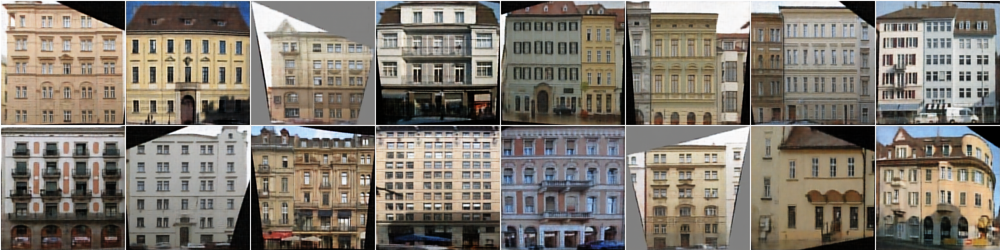

# pix2pix

A PyTorch implementation of "Image-to-Image Translation with Conditional Adversarial Nets", known as [`pix2pix`](https://phillipi.github.io/pix2pix/), for learning a mapping from input images to output images.

An exmple batch of intermediate generated fake results from model at epoch#500 in dataset `facades` (labels -> facades).



## Prerequisites

- Linux
- NVIDIA GPU + CUDA CuDNN (CPU mode may also work)

## Environments

- Python 3.5+ only
- PyTorch
- tochvision

## Train / Test

```bash
python main.py --phase [train | test]

# Help
usage: main.py [-h] --phase PHASE [--epochs EPOCHS] [--batchSize BATCHSIZE]
               [--imageSize IMAGESIZE] [--input_nc INPUT_NC]
               [--output_nc OUTPUT_NC] [--ngf NGF] [--ndf NDF] [--lr LR]
               [--beta1 BETA1] [--lamb LAMB] [--save_freq SAVE_FREQ]
               [--log_freq LOG_FREQ] [--dataset DATASET] [--log_dir LOG_DIR]
               [--output_dir OUTPUT_DIR] [--netG NETG] [--netD NETD]
               [--workers WORKERS] [--ngpu NGPU] [--cuda]
```

### Train

```bash
python main.py --phase train --cuda --epochs 200 --batchSize 1 --log_freq 10
```

### Test

```bash
python main.py --phase test --cuda --netG logs/generator_epoch200.pth
```

## Datasets

Download the datasets with  the script [`download_dataset.sh`](https://github.com/phillipi/pix2pix/blob/master/datasets/download_dataset.sh) from [phillipi](https://github.com/phillipi):

```bash
bash ./datasets/download_dataset.sh dataset_name
```

In current experiment, only `facades` dataset is used for reproducing implementation with PyTorch.

- `facades`: 400 images from [CMP Facades dataset](http://cmp.felk.cvut.cz/~tylecr1/facade/).

## Acknowledgement
- [phillipi/pix2pix](https://github.com/phillipi/pix2pix)
- [mrzhu-cool/pix2pix-pytorch](https://github.com/mrzhu-cool/pix2pix-pytorch)
